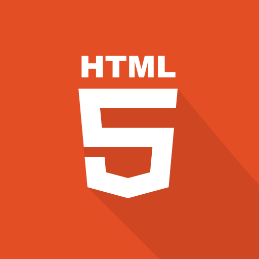
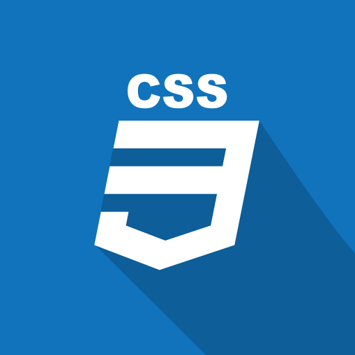
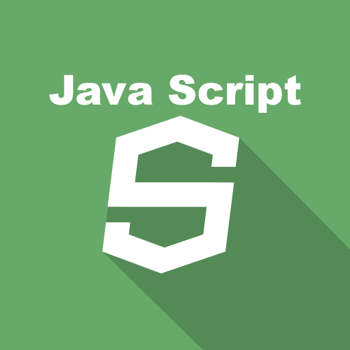
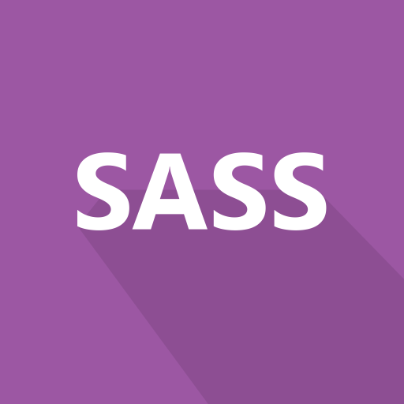
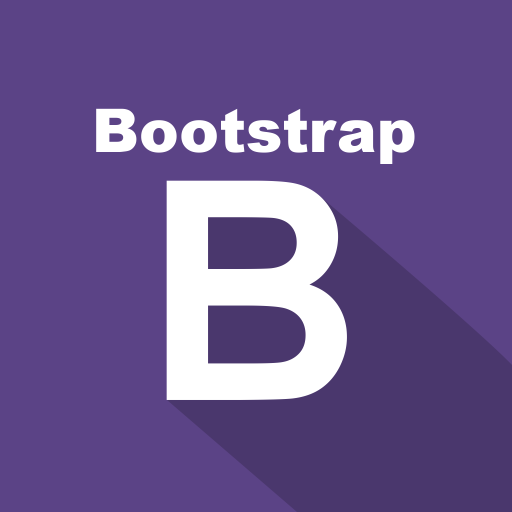
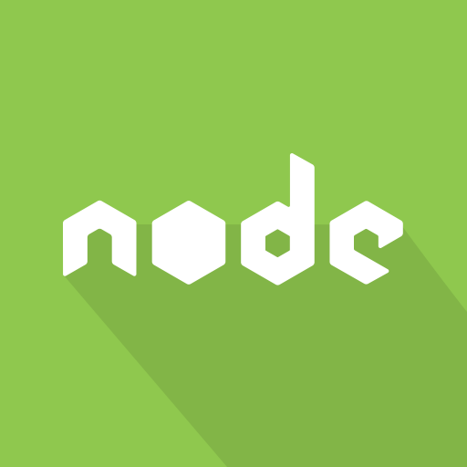
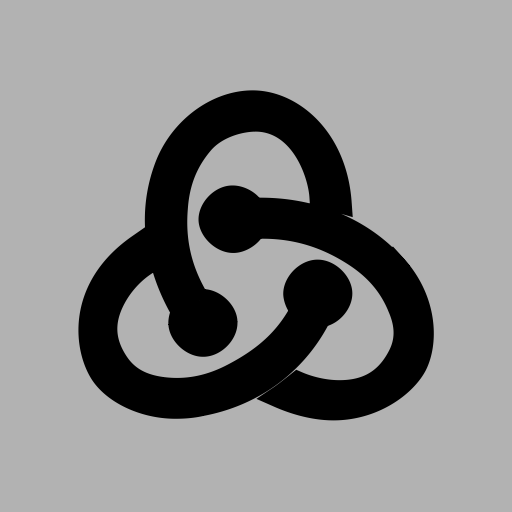

# Hi there, it's me, Martyna 👋

This whole year has been under a big sign of programming. Below you will find projects or applications for which I had to program specific elements that made the application a coherent whole. All this was done under the eye or with the help of a one-to-one mentor.

## What I've already learned from the Kodilla bootcamp: 

## What I am currently learning:

